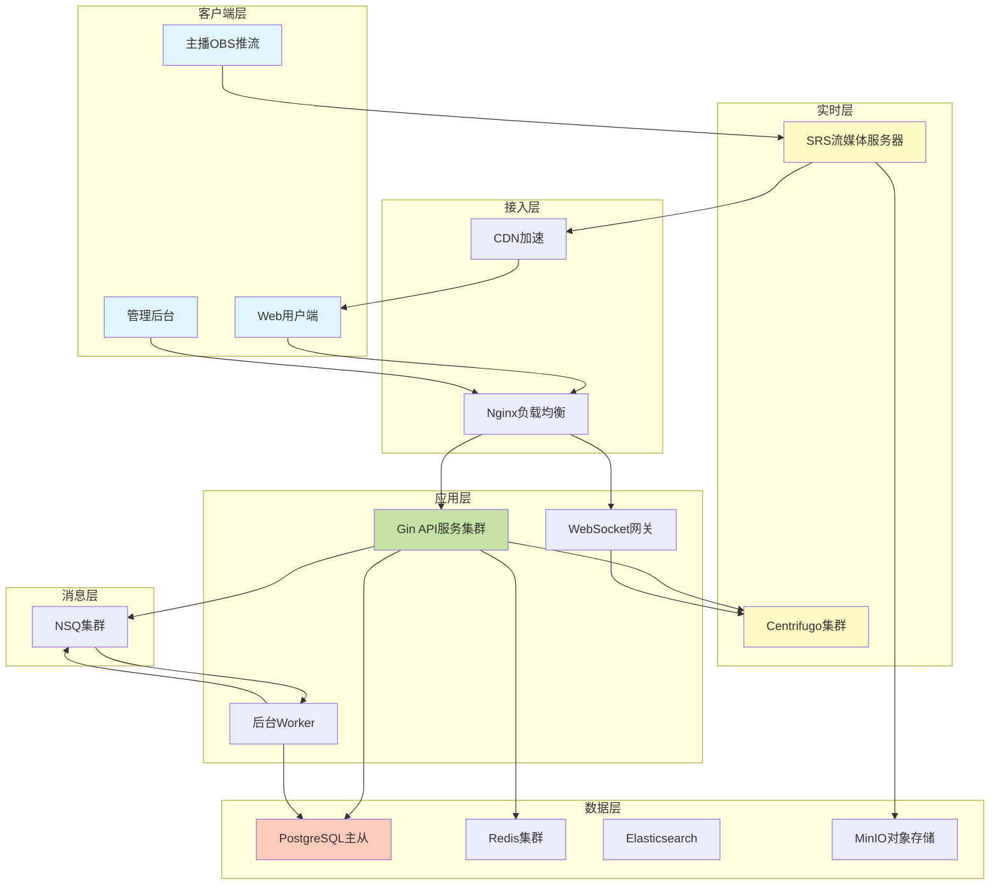

### 直播平台完整技术方案（精简版 - 2026年2月1日）

本方案提供**完整、可落地的技术实现计划**，用于构建类似虎牙的直播平台。重点在架构设计和功能细节，代码示例仅保留关键部分。

---

## 📋 目录

1. [核心功能清单](#核心功能清单)
2. [技术栈选型](#技术栈选型)
3. [系统架构](#系统架构)
4. [数据库设计](#数据库设计)
5. [核心业务流程](#核心业务流程)
6. [实时通信方案](#实时通信方案)
7. [流媒体方案](#流媒体方案)
8. [安全机制](#安全机制)
9. [性能优化](#性能优化)
10. [部署方案](#部署方案)

---

## 🎯 核心功能清单

### 用户端功能
- ✅ 用户注册/登录（手机/邮箱/第三方）
- ✅ 个人中心（资料/等级/勋章）
- ✅ 直播列表（分类/搜索/推荐）
- ✅ 直播观看（多清晰度切换）
- ✅ 实时弹幕（发送/接收/展示）
- ✅ 礼物系统（选择/购买/赠送）
- ✅ 关注主播（粉丝灯牌/特权）
- ✅ 虚拟货币（充值/消费/记录）
- ✅ 用户等级（经验值/特权解锁）
- ✅ 粉丝等级（忠诚度/加成系统）
- ✅ 直播回放（录像点播）

### 主播端功能
- ✅ 主播认证（身份验证）
- ✅ 开播管理（标题/分类/封面）
- ✅ 推流设置（密钥/服务器）
- ✅ 直播数据（观众/收益/互动）
- ✅ 粉丝管理（榜单/关系）
- ✅ 收益提现（对账/提现）

### 管理后台功能
- ✅ 实时监控（在线直播/观众数）
- ✅ 内容审核（违规检测/人工审核）
- ✅ 强制掐断（违规处理）
- ✅ 用户管理（封禁/等级调整）
- ✅ 礼物配置（新增/价格/上下架）
- ✅ 数据统计（DAU/收入/趋势）
- ✅ 敏感词管理（黑名单/白名单）
- ✅ 系统配置（参数/规则）

---

## 🛠️ 技术栈选型

### 后端技术栈
| 组件 | 技术选型 | 版本要求 | 选择理由 |
|------|----------|----------|----------|
| **应用框架** | Golang + Gin | Go 1.22+ | 高性能、并发友好 |
| **ORM** | GORM | v1.25+ | 类型安全、迁移方便 |
| **数据库** | PostgreSQL | 16+ | JSONB/分区/事务支持 |
| **缓存** | Redis | 7.4+ | 高性能KV/Pub/Sub |
| **消息队列** | NSQ | v1.3+ | 简单易用、无单点 |
| **流媒体** | SRS | v6.0+ | 开源、功能完整 |
| **实时通信** | Centrifugo | v6.6+ | WebSocket/历史消息 |
| **对象存储** | MinIO/OSS | - | 录制/头像/封面 |
| **搜索引擎** | Elasticsearch | 8+ | 全文搜索/日志分析 |

### 前端技术栈
| 组件 | 技术选型 | 版本要求 | 选择理由 |
|------|----------|----------|----------|
| **框架** | React | 18.3+ | 生态完善 |
| **构建工具** | Vite | 5+ | 快速HMR |
| **UI库** | Ant Design | 5+ | 企业级组件 |
| **状态管理** | Zustand | 4+ | 轻量简洁 |
| **视频播放** | Video.js | 8+ | 插件丰富 |
| **实时连接** | centrifuge-js | 5+ | 官方SDK |
| **动画** | Framer Motion + Lottie | - | 流畅动效 |

### WebRTC方案（可选低延迟）
| 组件 | 技术选型 | 说明 |
|------|----------|------|
| **信令服务** | SRS内置 | RTC推拉流 |
| **TURN服务** | Coturn | NAT穿透 |
| **延迟** | <500ms | 互动直播 |
| **适用场景** | 连麦/PK | 对延迟敏感 |

---

## 🏗️ 系统架构

### 整体架构图



### 核心组件职责

**1. API服务器（Golang Gin）**
- 用户认证与授权（JWT双Token）
- 业务逻辑处理（CRUD操作）
- SRS推流回调接收
- Centrifugo消息发布
- 限流与安全防护

**2. WebSocket网关**
- Centrifugo连接管理
- Token验证与刷新
- 心跳保活
- 消息分发

**3. Worker后台任务**
- 异步积分计算（NSQ消费）
- 统计数据汇总
- 定时任务（排行榜刷新）
- 录制文件处理

**4. SRS流媒体服务器**
- RTMP推流接收
- HLS/FLV/WebRTC分发
- 自动录制（DVR）
- 多码率转码
- 推流鉴权回调

**5. Centrifugo实时服务**
- WebSocket长连接
- 频道订阅/发布
- 消息历史存储
- 在线状态管理

---

## 💾 数据库设计

### ER关系图

```
┌─────────────┐         ┌──────────────┐         ┌─────────────┐
│   users     │◄────────│  streamers   │────────►│ live_rooms  │
│             │         │              │         │             │
│ - id (PK)   │         │ - user_id(FK)│         │ - id (PK)   │
│ - username  │         │ - stream_key │         │ - streamer  │
│ - level     │         │ - status     │         │ - status    │
│ - exp       │         └──────────────┘         │ - channel   │
│ - coins     │                                  └─────────────┘
└─────────────┘                │                        │
       │                       │                        │
       │                       ▼                        ▼
       │              ┌──────────────┐         ┌──────────────┐
       └─────────────►│fan_relations │         │danmu_records │
                      │              │         │              │
                      │- user_id(FK) │         │- room_id(FK) │
                      │- streamer_id │         │- user_id(FK) │
                      │- fan_level   │         │- content     │
                      │- points      │         └──────────────┘
                      └──────────────┘
                             │
                             ▼
                      ┌──────────────┐         ┌──────────────┐
                      │    gifts     │◄────────│gift_trans... │
                      │              │         │              │
                      │- id (PK)     │         │- sender_id   │
                      │- name        │         │- receiver_id │
                      │- price       │         │- room_id     │
                      │- animation   │         │- points_gain │
                      └──────────────┘         └──────────────┘
```

### 核心表设计（13张表）

#### 1. 用户相关（3张表）

**users - 用户主表**
```sql
CREATE TABLE users (
    id UUID PRIMARY KEY DEFAULT gen_random_uuid(),
    username VARCHAR(50) UNIQUE NOT NULL,
    password_hash VARCHAR(255) NOT NULL,
    nickname VARCHAR(100),
    avatar_url TEXT,
    phone VARCHAR(20) UNIQUE,
    email VARCHAR(100) UNIQUE,
    
    -- 等级系统
    level INT DEFAULT 1,
    exp BIGINT DEFAULT 0,
    
    -- 虚拟货币
    coin_balance INT DEFAULT 0,
    
    -- 状态
    status VARCHAR(20) DEFAULT 'active', -- active/banned/frozen
    last_login_at TIMESTAMPTZ,
    created_at TIMESTAMPTZ DEFAULT NOW(),
    updated_at TIMESTAMPTZ DEFAULT NOW(),
    
    INDEX idx_username (username),
    INDEX idx_level (level DESC),
    INDEX idx_status (status)
);
```

**streamers - 主播扩展表**
```sql
CREATE TABLE streamers (
    user_id UUID PRIMARY KEY REFERENCES users(id),
    stream_key VARCHAR(128) UNIQUE NOT NULL,
    stream_key_expire_at TIMESTAMPTZ,
    rtmp_url TEXT,
    
    -- 主播状态
    status VARCHAR(20) DEFAULT 'offline', -- offline/live/banned
    is_verified BOOLEAN DEFAULT false,
    
    -- 统计
    total_revenue BIGINT DEFAULT 0,
    follower_count INT DEFAULT 0,
    total_live_duration INT DEFAULT 0, -- 秒
    
    created_at TIMESTAMPTZ DEFAULT NOW(),
    
    INDEX idx_status (status),
    INDEX idx_verified (is_verified),
    INDEX idx_follower_count (follower_count DESC)
);
```

**fan_relations - 粉丝关系表**
```sql
CREATE TABLE fan_relations (
    user_id UUID NOT NULL REFERENCES users(id),
    streamer_id UUID NOT NULL REFERENCES users(id),
    
    -- 粉丝等级
    fan_level INT DEFAULT 1,
    loyalty_points BIGINT DEFAULT 0,
    
    -- 灯牌
    badge_name VARCHAR(20),
    badge_worn BOOLEAN DEFAULT true,
    
    -- 统计
    total_gift_amount BIGINT DEFAULT 0,
    followed_at TIMESTAMPTZ DEFAULT NOW(),
    last_gift_at TIMESTAMPTZ,
    
    PRIMARY KEY (user_id, streamer_id),
    INDEX idx_streamer_points (streamer_id, loyalty_points DESC),
    INDEX idx_user_follow (user_id, followed_at DESC)
);
```

#### 2. 直播相关（2张表）

**live_rooms - 直播间表**
```sql
CREATE TABLE live_rooms (
    id UUID PRIMARY KEY DEFAULT gen_random_uuid(),
    streamer_id UUID NOT NULL REFERENCES users(id),
    
    -- 基本信息
    title VARCHAR(200) NOT NULL,
    category VARCHAR(50),
    cover_url TEXT,
    
    -- 实时通信
    channel_name VARCHAR(100) UNIQUE NOT NULL, -- live:room_{uuid}
    
    -- 状态
    status VARCHAR(20) DEFAULT 'ended', -- live/ended/banned
    start_at TIMESTAMPTZ,
    end_at TIMESTAMPTZ,
    
    -- 统计
    peak_online INT DEFAULT 0,
    total_views INT DEFAULT 0,
    
    -- 录制
    record_url TEXT,
    
    created_at TIMESTAMPTZ DEFAULT NOW(),
    
    INDEX idx_streamer_status (streamer_id, status),
    INDEX idx_status_start (status, start_at DESC),
    INDEX idx_category (category)
);
```

**danmu_records - 弹幕记录表（按月分区）**
```sql
CREATE TABLE danmu_records (
    id BIGSERIAL,
    room_id UUID NOT NULL REFERENCES live_rooms(id),
    user_id UUID NOT NULL REFERENCES users(id),
    content TEXT NOT NULL,
    
    -- 审核
    is_filtered BOOLEAN DEFAULT false,
    filter_reason TEXT,
    
    created_at TIMESTAMPTZ DEFAULT NOW(),
    
    PRIMARY KEY (id, created_at)
) PARTITION BY RANGE (created_at);

-- 创建分区（自动化脚本）
CREATE TABLE danmu_records_2026_02 PARTITION OF danmu_records
    FOR VALUES FROM ('2026-02-01') TO ('2026-03-01');
```

#### 3. 礼物相关（3张表）

**gifts - 礼物配置表**
```sql
CREATE TABLE gifts (
    id SERIAL PRIMARY KEY,
    name VARCHAR(50) NOT NULL,
    coin_price INT NOT NULL CHECK (coin_price > 0),
    icon_url TEXT NOT NULL,
    
    -- 动画
    animation_type VARCHAR(20), -- lottie/css/particle/none
    animation_url TEXT,
    
    -- 限制
    min_level_required INT DEFAULT 1,
    is_active BOOLEAN DEFAULT true,
    
    -- 排序
    sort_order INT DEFAULT 0,
    category VARCHAR(20) DEFAULT 'normal', -- normal/vip/special
    
    created_at TIMESTAMPTZ DEFAULT NOW(),
    
    INDEX idx_active_sort (is_active, sort_order)
);
```

**gift_transactions - 礼物交易记录**
```sql
CREATE TABLE gift_transactions (
    id BIGSERIAL PRIMARY KEY,
    sender_id UUID NOT NULL REFERENCES users(id),
    receiver_id UUID NOT NULL REFERENCES users(id),
    room_id UUID NOT NULL REFERENCES live_rooms(id),
    gift_id INT NOT NULL REFERENCES gifts(id),
    
    gift_count INT DEFAULT 1,
    coin_amount INT NOT NULL,
    
    -- 积分计算
    loyalty_points_gained BIGINT,
    user_level_at_send INT,
    bonus_multiplier DECIMAL(5,2) DEFAULT 1.0,
    
    created_at TIMESTAMPTZ DEFAULT NOW(),
    
    INDEX idx_room_created (room_id, created_at DESC),
    INDEX idx_sender_created (sender_id, created_at DESC),
    INDEX idx_receiver_revenue (receiver_id, created_at DESC)
);
```

**coin_transactions - 货币交易记录**
```sql
CREATE TABLE coin_transactions (
    id BIGSERIAL PRIMARY KEY,
    user_id UUID NOT NULL REFERENCES users(id),
    
    amount INT NOT NULL, -- 正数充值，负数消费
    balance_after INT NOT NULL,
    
    type VARCHAR(20) NOT NULL, -- recharge/gift/refund/system
    related_id BIGINT, -- 关联交易ID
    description TEXT,
    
    created_at TIMESTAMPTZ DEFAULT NOW(),
    
    INDEX idx_user_created (user_id, created_at DESC),
    INDEX idx_type (type)
);
```

#### 4. 配置相关（2张表）

**level_config - 等级配置表**
```sql
CREATE TABLE level_config (
    level INT PRIMARY KEY,
    
    -- 用户等级要求
    exp_required BIGINT NOT NULL,
    
    -- 粉丝等级要求
    loyalty_points_required BIGINT,
    
    -- 加成
    bonus_multiplier DECIMAL(5,2) DEFAULT 1.0,
    
    -- 展示
    level_name VARCHAR(50),
    icon_url TEXT,
    color VARCHAR(7) -- hex颜色
);

-- 预填充数据
INSERT INTO level_config (level, exp_required, loyalty_points_required, bonus_multiplier, level_name, color) VALUES
(1, 0, 0, 1.0, '萌新', '#999999'),
(2, 2000, 8000, 1.05, '新秀', '#3498db'),
(5, 20000, 50000, 1.15, '精英', '#9b59b6'),
(10, 100000, 200000, 1.30, '大师', '#e74c3c'),
(20, 500000, 1000000, 1.60, '传奇', '#f39c12'),
(30, 1500000, 3000000, 2.00, '神话', '#e67e22');
```

**sensitive_words - 敏感词表**
```sql
CREATE TABLE sensitive_words (
    id SERIAL PRIMARY KEY,
    word VARCHAR(50) NOT NULL,
    type VARCHAR(20) DEFAULT 'blacklist', -- blacklist/whitelist
    severity VARCHAR(10) DEFAULT 'medium', -- low/medium/high
    is_active BOOLEAN DEFAULT true,
    created_at TIMESTAMPTZ DEFAULT NOW(),
    
    INDEX idx_word (word),
    INDEX idx_active (is_active)
);
```

#### 5. 其他表（3张）

**follow_records - 关注记录**
```sql
CREATE TABLE follow_records (
    user_id UUID NOT NULL REFERENCES users(id),
    streamer_id UUID NOT NULL REFERENCES users(id),
    followed_at TIMESTAMPTZ DEFAULT NOW(),
    
    PRIMARY KEY (user_id, streamer_id),
    INDEX idx_streamer_time (streamer_id, followed_at DESC)
);
```

**admin_logs - 管理日志**
```sql
CREATE TABLE admin_logs (
    id BIGSERIAL PRIMARY KEY,
    admin_id UUID NOT NULL REFERENCES users(id),
    action VARCHAR(50) NOT NULL, -- ban_user/kill_stream/edit_gift
    target_type VARCHAR(20), -- user/room/gift
    target_id VARCHAR(100),
    reason TEXT,
    created_at TIMESTAMPTZ DEFAULT NOW(),
    
    INDEX idx_admin_created (admin_id, created_at DESC),
    INDEX idx_action (action)
);
```

**system_config - 系统配置**
```sql
CREATE TABLE system_config (
    key VARCHAR(50) PRIMARY KEY,
    value TEXT NOT NULL,
    description TEXT,
    updated_at TIMESTAMPTZ DEFAULT NOW()
);

-- 预填充
INSERT INTO system_config (key, value, description) VALUES
('danmu_rate_limit', '20', '每分钟弹幕数限制'),
('gift_rate_limit', '30', '每分钟礼物数限制'),
('coin_recharge_min', '10', '最小充值金额'),
('stream_key_expire_days', '30', '推流密钥有效期（天）');
```

---

## 🔄 核心业务流程

### 1. 用户注册与登录

**注册流程**
```
用户填写信息 → 验证码校验 → 密码加密(bcrypt) 
→ 创建用户记录 → 发送JWT Token → 自动登录
```

**登录流程（双Token机制）**
```
输入账号密码 → 验证身份 → 生成AccessToken(15分钟) + RefreshToken(7天)
→ 返回用户信息 → 前端存储Token → 请求携带Authorization头

Token刷新: RefreshToken → 验证有效性 → 生成新AccessToken → 延长会话
```

### 2. 直播开播流程

**主播端操作**
```
1. 点击开播按钮
2. 填写标题/分类/封面
3. API创建live_room记录（status=live）
4. 生成stream_key（如未过期则复用）
5. 返回推流地址: rtmp://server/live?key={stream_key}
6. 主播用OBS配置推流
7. OBS推流 → SRS收到 → 回调API验证
8. 验证通过 → SRS接受流 → 生成播放地址
9. 观众可观看
```

**关键点**
- stream_key有效期30天，到期自动刷新
- 推流回调验证：检查key有效性、主播状态、是否被封禁
- 同一主播只能开一个直播间（检查已有live状态）

### 3. 弹幕发送流程

**完整链路**
```
用户输入 → 前端验证长度/频率 → API接收
→ JWT验证用户身份 → Redis限流检查(20条/分钟)
→ 敏感词过滤（DFA算法） → 存储到danmu_records
→ Centrifugo发布到频道 → 所有订阅者接收
→ Canvas渲染弹幕
```

**限流规则**
- 普通用户: 20条/分钟
- VIP用户: 50条/分钟
- 主播粉丝团: 30条/分钟

### 4. 礼物赠送流程（关键事务）

**完整步骤**
```
1. 用户选择礼物 + 数量
2. 前端计算总价 → 确认弹窗
3. API接收请求 → 开启数据库事务

   3.1 查询礼物配置（价格/限制）
   3.2 行级锁查询用户余额（SELECT FOR UPDATE）
   3.3 检查余额是否充足
   3.4 扣除金币 → 记录coin_transactions
   3.5 查询用户当前等级 → 获取bonus_multiplier
   3.6 计算忠诚度积分 = 金币 * 加成倍数
   3.7 更新fan_relations（UPSERT + loyalty_points累加）
   3.8 重新计算粉丝等级（查level_config表）
   3.9 更新主播total_revenue
   3.10 创建gift_transactions记录
   
4. 提交事务
5. 发送NSQ消息（异步更新经验值）
6. Centrifugo广播礼物事件 → 触发动画
7. 返回成功 + 新余额
```

**关键保障**
- 数据库事务ACID保证
- 行级锁防止超扣
- 异步任务解耦统计逻辑

### 5. 在线人数统计

**方案：Redis HyperLogLog**
```
观众进入直播间:
  - 订阅Centrifugo频道
  - 每10秒发送心跳 → API
  - API执行: PFADD room:online:{room_id} {user_id}
  - 设置过期时间30秒

统计查询:
  - API执行: PFCOUNT room:online:{room_id}
  - 误差率<1%，内存占用仅12KB

广播更新:
  - 定时任务每5秒查询在线数
  - Centrifugo推送 {type: "online_count", count: xxx}
```

### 6. 粉丝等级计算

**双等级系统**

**用户等级（平台活跃度）**
- 经验来源: 每日登录(+10)、观看时长(1分钟=1exp)、送礼(金币/10)、分享(+5)
- 升级公式: level = floor(exp / 2000) + 1
- 特权: 解锁功能、弹幕样式、专属标识

**粉丝等级（对主播忠诚度）**
- 积分来源: 仅送礼（金币 × 用户等级加成）
- 升级公式: fan_level = floor(loyalty_points / 8000) + 1
- 特权: 灯牌、弹幕优先、房管权限、粉丝专属礼物

**加成机制**
```
用户等级1-9:   无加成 (1.0x)
用户等级10-19: +5%加成 (1.05x)
用户等级20-29: +15%加成 (1.15x)
用户等级30+:   +30%加成 (1.30x)

示例: 
  10级用户送100金币礼物 → 粉丝积分+105
  25级用户送100金币礼物 → 粉丝积分+115
```

### 7. 直播掐断机制

**触发条件**
- 管理员手动操作
- 自动审核系统检测违规
- 用户举报达到阈值

**执行流程**
```
1. 管理后台点击"掐断直播"
2. API验证管理员权限
3. 调用SRS API获取客户端列表
   GET http://srs:8085/api/v1/clients?stream={stream_id}
4. 找到推流客户端 → 踢掉
   DELETE http://srs:8085/api/v1/clients/{client_id}
5. 更新数据库 live_rooms.status = 'banned'
6. Centrifugo广播下播消息 → 观众端显示提示
7. 记录admin_logs
```

---

## 📡 实时通信方案（Centrifugo）

### 频道设计

| 频道命名 | 用途 | 订阅者 | 消息类型 |
|----------|------|--------|----------|
| `live:room_{room_id}` | 直播间主频道 | 所有观众 | 弹幕/礼物/公告 |
| `live:room_{room_id}:streamer` | 主播私有频道 | 仅主播 | 后台消息/管理通知 |
| `user:{user_id}` | 用户私有频道 | 该用户 | 系统通知/私信 |
| `global:notifications` | 全局通知 | 所有在线用户 | 系统公告/活动 |

### 消息格式标准

```json
{
  "type": "danmu|gift|online_count|stream_status|notification",
  "timestamp": 1738368000000,
  "data": {
    // 根据type变化的数据
  }
}
```

**弹幕消息示例**
```json
{
  "type": "danmu",
  "timestamp": 1738368000000,
  "data": {
    "id": "msg_123",
    "user": {
      "id": "user_456",
      "nickname": "张三",
      "level": 15,
      "avatar": "https://cdn.com/avatar.jpg",
      "badges": ["粉丝团", "VIP"]
    },
    "content": "主播666",
    "color": "#3498db"
  }
}
```

**礼物消息示例**
```json
{
  "type": "gift",
  "timestamp": 1738368000000,
  "data": {
    "sender": {
      "id": "user_789",
      "nickname": "李四",
      "level": 20
    },
    "gift": {
      "id": 5,
      "name": "火箭",
      "icon": "https://cdn.com/rocket.png",
      "animation": "https://cdn.com/rocket.json"
    },
    "count": 1,
    "combo": 3, // 连击
    "total_value": 100
  }
}
```

### 连接认证流程

```
1. 前端请求 GET /api/centrifugo/token
2. 后端生成JWT（包含user_id + 可订阅频道列表）
3. 前端用Token连接Centrifugo WebSocket
4. Centrifugo验证Token有效性
5. 连接成功 → 订阅频道
6. Token过期前刷新（前端监听expiring事件）
```

### 消息历史

**配置**
- 每个频道保留最近100条消息
- 存储5分钟（Redis TTL）
- 新观众进入时拉取历史

**使用场景**
- 用户刷新页面不丢失弹幕
- 新进观众看到最近互动
- 断线重连后补齐消息

---

## 🎬 流媒体方案（SRS）

### 推流配置

**RTMP推流地址格式**
```
rtmp://{server}/live?key={stream_key}

示例: rtmp://live.example.com/live?key=abc123xyz
```

**OBS设置**
- 服务器: rtmp://live.example.com/live
- 串流密钥: abc123xyz
- 比特率: 2500-4500 Kbps（720p/1080p）
- 编码器: x264
- 音频: AAC 128kbps

### 播放地址生成

**多协议支持**

| 协议 | 延迟 | 格式 | 适用场景 |
|------|------|------|----------|
| **HLS** | 8-15秒 | .m3u8 | iOS/Safari浏览器 |
| **HTTP-FLV** | 2-5秒 | .flv | PC浏览器（推荐） |
| **WebRTC** | <1秒 | RTC | 连麦/互动直播 |

**地址示例**
```
HLS:  https://live.example.com/live/stream_123.m3u8
FLV:  https://live.example.com/live/stream_123.flv
RTC:  webrtc://live.example.com/live/stream_123
```

### 多码率转码

**配置三档清晰度**

| 档位 | 分辨率 | 码率 | 帧率 | 用途 |
|------|--------|------|------|------|
| **原画** | 原始 | 原始 | 原始 | VIP用户 |
| **高清** | 1280x720 | 1500kbps | 30fps | 默认 |
| **流畅** | 854x480 | 800kbps | 25fps | 网络差 |

**SRS转码引擎**
```nginx
transcode {
    enabled on;
    ffmpeg ./objs/ffmpeg/bin/ffmpeg;
    
    engine hd {
        enabled on;
        vcodec libx264;
        vbitrate 1500;
        vwidth 1280;
        vheight 720;
        output rtmp://127.0.0.1/live/stream_hd;
    }
    
    engine sd {
        enabled on;
        vcodec libx264;
        vbitrate 800;
        vwidth 854;
        vheight 480;
        output rtmp://127.0.0.1/live/stream_sd;
    }
}
```

### 直播录制（DVR）

**自动录制配置**
```nginx
dvr {
    enabled on;
    dvr_path ./record/[app]/[stream]/[timestamp].mp4;
    dvr_plan session; // 按推流会话录制
    dvr_duration 1800; // 单文件30分钟
    dvr_wait_keyframe on;
}
```

**录制完成回调**
```
SRS完成录制 → POST /api/srs/callback/record_done
→ API收到文件路径 → 上传MinIO/OSS
→ 更新live_rooms.record_url → 提供回放
```

### WebRTC低延迟方案

**适用场景**
- 主播连麦PK
- 观众连麦互动
- 实时游戏直播

**配置要点**
```nginx
rtc_server {
    enabled on;
    listen 8000;
    candidate $CANDIDATE; // 公网IP
}

vhost __defaultVhost__ {
    rtc {
        enabled on;
        rtmp_to_rtc on;
        rtc_to_rtmp on;
    }
}
```

**TURN服务器（NAT穿透）**
- 使用Coturn搭建
- 配置STUN/TURN服务器地址
- 保证P2P连接成功率

---

## 🔐 安全机制

### 1. 认证与授权

**JWT Token设计**
```json
AccessToken (15分钟):
{
  "user_id": "uuid",
  "username": "zhangsan",
  "role": "user|streamer|admin",
  "level": 15,
  "exp": 1738368900
}

RefreshToken (7天):
{
  "user_id": "uuid",
  "type": "refresh",
  "exp": 1738972800
}
```

**权限分级**
- **游客**: 仅观看、不能互动
- **注册用户**: 弹幕、礼物、关注
- **主播**: 开播、管理粉丝
- **管理员**: 全部权限、审核、封禁

### 2. 推流安全

**Stream Key管理**
- 生成: 使用crypto/rand随机64字节
- 存储: 数据库加密存储（AES-256）
- 有效期: 30天自动刷新
- 泄露处理: 立即作废，重新生成

**推流鉴权回调**
```
OBS推流 → SRS接收 → POST /api/srs/callback/publish
→ 验证stream_key有效性
→ 检查主播状态（是否被封禁）
→ 检查是否多终端推流（踢掉旧连接）
→ 返回code=0允许/code=1拒绝
```

### 3. 限流防刷

**多层限流**

**应用层（Gin中间件）**
```go
// API全局限流: 100 req/s per IP
RateLimit(100, 1*time.Second)

// 敏感接口加强
POST /danmu/send    → 20/min per user
POST /gifts/send    → 30/min per user
POST /auth/login    → 10/min per IP
```

**Redis限流（Lua脚本原子操作）**
```lua
local key = KEYS[1]
local limit = tonumber(ARGV[1])
local window = tonumber(ARGV[2])
local current = redis.call('INCR', key)

if current == 1 then
    redis.call('EXPIRE', key, window)
end

if current > limit then
    return 0  -- 拒绝
end
return 1  -- 通过
```

### 4. 敏感词过滤

**实现方案：DFA算法**

**特点**
- 时间复杂度: O(n)，n为文本长度
- 空间复杂度: O(m)，m为敏感词总字符数
- 性能: 百万级敏感词秒级检测

**处理策略**
- **低级**: 替换为***
- **中级**: 直接拒绝发送
- **高级**: 拒绝+记录+警告/封禁

**敏感词库管理**
- 数据库存储（支持热更新）
- 分类: 政治/色情/辱骂/广告
- 白名单: 误伤词汇恢复

### 5. 防刷礼物

**风控规则**
- 短时间大额消费 → 人工审核
- 同一用户反复送同一礼物 → 验证码
- IP异常（代理/多账号） → 限制
- 设备指纹识别 → 防多开

### 6. 数据安全

**传输安全**
- HTTPS强制（Let's Encrypt证书）
- WebSocket升级为WSS
- SRS支持RTMPS（可选）

**存储安全**
- 密码: bcrypt加密（cost=12）
- 敏感字段: AES-256加密
- 数据库: PostgreSQL行级安全策略
- 备份: 每日全量+实时归档

**合规要求**
- 用户数据导出功能
- 注销账户清理数据
- 未成年人保护（身份验证）
- 审计日志保留180天

---

## ⚡ 性能优化

### 1. 数据库优化

**索引策略**
- 高频查询字段建立索引
- 复合索引覆盖查询
- 避免过多索引影响写入

**关键索引**
```sql
-- 直播列表查询
CREATE INDEX idx_live_status_start ON live_rooms(status, start_at DESC);

-- 礼物排行榜
CREATE INDEX idx_gift_receiver_amount ON gift_transactions(receiver_id, created_at DESC);

-- 粉丝榜
CREATE INDEX idx_fan_streamer_points ON fan_relations(streamer_id, loyalty_points DESC);
```

**分区表**
- danmu_records按月分区
- gift_transactions按季度分区
- 自动清理超过1年的历史数据

**连接池**
- PostgreSQL: max_connections=200
- 使用PgBouncer中间层: pool_mode=transaction
- API服务: 每实例20个连接

**查询优化**
- EXPLAIN ANALYZE分析慢查询
- 物化视图缓存统计数据（礼物日榜）
- 定时任务刷新（每小时）

### 2. Redis优化

**数据结构选择**
- String: 简单KV缓存
- Hash: 用户信息/直播间信息
- List: 最近弹幕（LPUSH + LTRIM）
- ZSet: 排行榜（ZADD + ZREVRANGE）
- HyperLogLog: 在线人数统计

**过期策略**
- 用户Session: 7天
- 直播间缓存: 5分钟
- 在线人数: 30秒
- 弹幕历史: 5分钟

**内存优化**
- 设置maxmemory限制
- 使用LRU淘汰策略
- 避免大Key（单个>1MB拆分）

### 3. 前端优化

**首屏加载**
- 路由懒加载（Code Splitting）
- 图片懒加载（Intersection Observer）
- CDN加速静态资源
- Gzip/Brotli压缩

**直播间性能**
- Canvas弹幕渲染（离屏Canvas）
- 虚拟滚动（react-window）
- 节流防抖（弹幕发送）
- Web Worker处理大量数据

**资源优化**
- WebP格式图片
- 雪碧图合并小图标
- 字体子集化（中文字体）
- Service Worker离线缓存

### 4. CDN加速

**静态资源CDN**
- 头像/封面/礼物图标
- JS/CSS/字体文件
- 录制回放视频

**直播流CDN**
- 生产环境必备
- 选择: 阿里云/腾讯云/七牛
- SRS forward到CDN推流点
- API返回CDN播放地址

**回源优化**
- 设置合理Cache-Control
- 使用ETag协商缓存
- 预热热门直播间

### 5. 架构扩展

**水平扩展**
- API服务: 无状态，Nginx负载均衡
- SRS: 多节点Origin + Edge集群
- Centrifugo: Redis作为消息总线
- PostgreSQL: 读写分离 + 分片

**垂直扩展**
- 数据库: 增加内存/SSD
- Redis: 增加内存
- SRS: 增加CPU/网络带宽

**异步化**
- 积分计算异步（NSQ）
- 日志写入异步（ElasticSearch）
- 统计任务定时批处理

---

## 🚀 部署方案

### 1. 本地开发环境

**Docker Compose一键启动**
```bash
# 项目结构
live-platform/
├── docker-compose.yml
├── api/              # Golang后端
├── web/              # React前端
├── admin/            # 管理后台
├── srs.conf          # SRS配置
├── centrifugo.json   # Centrifugo配置
└── init.sql          # 数据库初始化

# 启动
docker-compose up -d

# 访问
Web:   http://localhost:3000
Admin: http://localhost:3001
API:   http://localhost:8888
SRS:   rtmp://localhost/live
```

**核心服务清单**
- PostgreSQL: 5432
- Redis: 6379
- NSQ: 4150/4151
- SRS: 1935(RTMP), 8080(HTTP)
- Centrifugo: 8000
- API: 8888
- Web: 3000
- Admin: 3001

### 2. 生产环境（Kubernetes）

**集群规划**
```
节点类型          数量    规格
----------------  ----    ------------------
Master Node       3       4C8G
API Node          5       8C16G
SRS Node          3       16C32G (高带宽)
DB Node           2       16C64G (SSD)
Redis Node        3       8C16G
```

**核心组件部署**

**API服务（Deployment）**
- Replicas: 5
- HPA: CPU>70%自动扩容（max 20）
- Resource Limits: 2C4G per pod
- Health Check: /health端点

**SRS集群（StatefulSet）**
- Replicas: 3
- 持久化存储: 录制文件
- Service: LoadBalancer类型
- 网络: 高带宽保障

**PostgreSQL（主从复制）**
- Master: 1个（写）
- Slave: 2个（读）
- 使用Patroni实现HA
- PVC: SSD存储

**Redis Cluster**
- 3 Master + 3 Slave
- 哨兵模式（Sentinel）
- 持久化: AOF + RDB

### 3. CI/CD流程

**代码提交 → 自动化部署**
```
1. Git Push到main分支
2. GitLab CI触发Pipeline
3. 运行单元测试 + 代码扫描
4. 构建Docker镜像 → 推送Harbor
5. 更新K8s Deployment（滚动更新）
6. 健康检查通过 → 完成部署
7. 通知Slack/钉钉
```

**回滚机制**
- 保留最近5个镜像版本
- 一键回滚命令
- 数据库迁移版本控制（Flyway/GORM AutoMigrate）

### 4. 监控告警

**监控栈: Prometheus + Grafana**

**监控指标**
- 系统: CPU/内存/磁盘/网络
- 应用: QPS/延迟/错误率
- 业务: 在线人数/开播数/收入

**关键Dashboard**
- 实时直播监控（各直播间在线/码率）
- API性能监控（P99延迟/错误率）
- 数据库监控（慢查询/连接数）
- SRS监控（推流数/观看数/带宽）

**告警规则**
```yaml
- name: high_error_rate
  expr: sum(rate(http_requests_total{status=~"5.."}[5m])) > 10
  severity: critical
  
- name: database_slow_query
  expr: pg_slow_queries_total > 100
  severity: warning
  
- name: srs_stream_down
  expr: srs_publish_streams == 0 and live_rooms_status{status="live"} > 0
  severity: critical
```

**日志方案: ELK Stack**
- Filebeat收集日志
- Logstash处理
- Elasticsearch存储
- Kibana可视化

### 5. 备份恢复

**数据库备份**
- 每日凌晨3点全量备份
- 每小时增量备份（WAL归档）
- 保留30天备份
- 异地容灾（OSS多区域）

**恢复演练**
- 每月执行一次恢复测试
- RTO: 1小时
- RPO: 1小时

---

## 📊 开发计划与预算

### 开发阶段（10周）

| 阶段 | 周期 | 主要任务 | 产出 |
|------|------|----------|------|
| **Phase 1** | 2周 | 环境搭建、数据库设计、基础API | 可运行的后端框架 |
| **Phase 2** | 3周 | SRS集成、Centrifugo实时通信、前端框架 | 推流+观看功能 |
| **Phase 3** | 2周 | 弹幕系统、礼物系统、等级系统 | 核心互动功能 |
| **Phase 4** | 1周 | 管理后台、监控系统 | 运营工具 |
| **Phase 5** | 1周 | 安全加固、性能优化 | 生产就绪 |
| **Phase 6** | 1周 | 测试、文档、上线准备 | 正式发布 |

### 技术难点

| 难点 | 解决方案 | 优先级 |
|------|----------|--------|
| 高并发弹幕 | Centrifugo + Redis + Canvas优化 | 高 |
| 礼物事务一致性 | PostgreSQL事务 + 行锁 | 高 |
| 低延迟直播 | WebRTC(SRS) + CDN加速 | 中 |
| 敏感词过滤性能 | DFA算法 + 缓存 | 中 |
| 在线人数准确性 | HyperLogLog + 心跳机制 | 中 |
| 大规模用户扩展 | 分库分表 + 读写分离 | 低 |

### 成本预估（月度）

**基础版（支持1000并发观众）**
- 服务器: 5台云主机（8C16G） = ¥3000
- 数据库: RDS PostgreSQL = ¥1500
- Redis: 16GB集群 = ¥800
- CDN流量: 10TB = ¥2000
- OSS存储: 1TB = ¥200
- **总计: ¥7500/月**

**企业版（支持10000并发）**
- 服务器: 20台云主机 = ¥12000
- 数据库: 主从 + 分片 = ¥5000
- Redis: 64GB集群 = ¥3000
- CDN流量: 100TB = ¥18000
- OSS存储: 10TB = ¥2000
- **总计: ¥40000/月**

---

## 🎯 总结

### 方案优势

1. **技术选型成熟**: 全部使用生产验证的开源组件
2. **架构可扩展**: 支持水平/垂直扩展
3. **性能优化充分**: 多层缓存 + 异步处理
4. **安全机制完善**: 认证/限流/审核全覆盖
5. **开发效率高**: 组件现成，专注业务逻辑
6. **成本可控**: 按需扩展，避免过度设计

### 下一步行动

**立即开始**
1. 搭建开发环境（Docker Compose）
2. 创建数据库表结构
3. 实现用户认证API
4. 集成SRS基础推流

**1周内完成**
- 基础API框架
- 数据库CRUD
- JWT认证
- SRS推流测试

**2周内完成**
- Centrifugo集成
- 弹幕功能
- 前端直播间页面
- 基础管理后台

**最终目标**
- 10周内完成MVP
- 支持100并发直播间
- 满足基本商业运营需求

---

## 附录

### 推荐学习资源

**SRS文档**: https://ossrs.io/lts/zh-cn/  
**Centrifugo文档**: https://centrifugal.dev/  
**GORM文档**: https://gorm.io/zh_CN/  
**Gin文档**: https://gin-gonic.com/zh-cn/  
**Video.js文档**: https://videojs.com/  

### 常见问题FAQ

**Q: 如何实现秒级延迟？**  
A: 使用WebRTC代替RTMP，配置SRS的rtc模块，延迟可降至<1秒。

**Q: 如何防止恶意刷礼物？**  
A: 多层防护：限流 + 行为分析 + 风控规则 + 人工审核。

**Q: 数据库如何扩展？**  
A: 垂直扩展（升级配置）→ 读写分离 → 分库分表（按streamer_id）。

**Q: CDN成本如何优化？**  
A: 低观看量自建，高观看量用CDN；压缩码率；预热热门直播。

**Q: 如何保证在线人数准确？**  
A: HyperLogLog统计 + 心跳机制 + 定期清理过期用户。

---

**方案版本**: v3.0 精简版  
**最后更新**: 2026-02-01  
**适用人群**: 技术团队/产品经理/架构师  
**文档维护**: 开发组